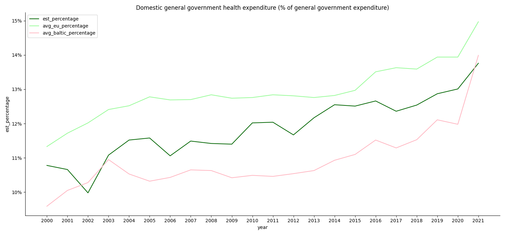
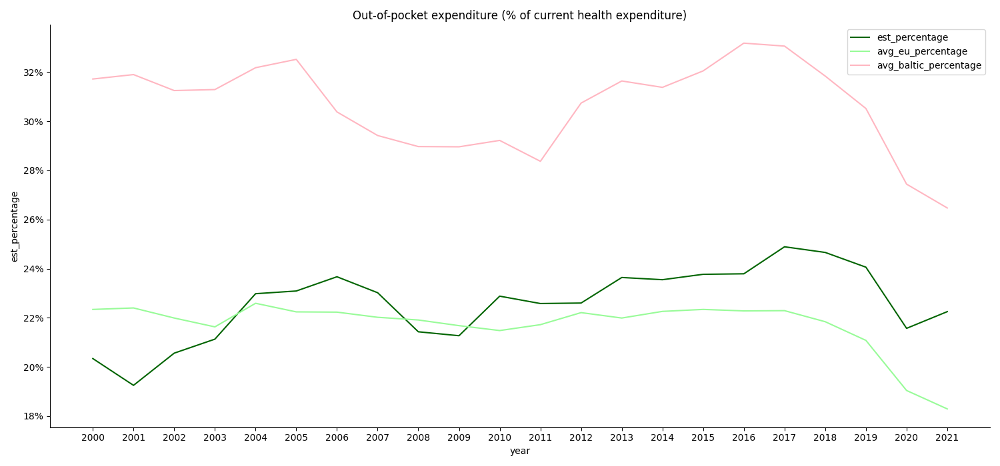
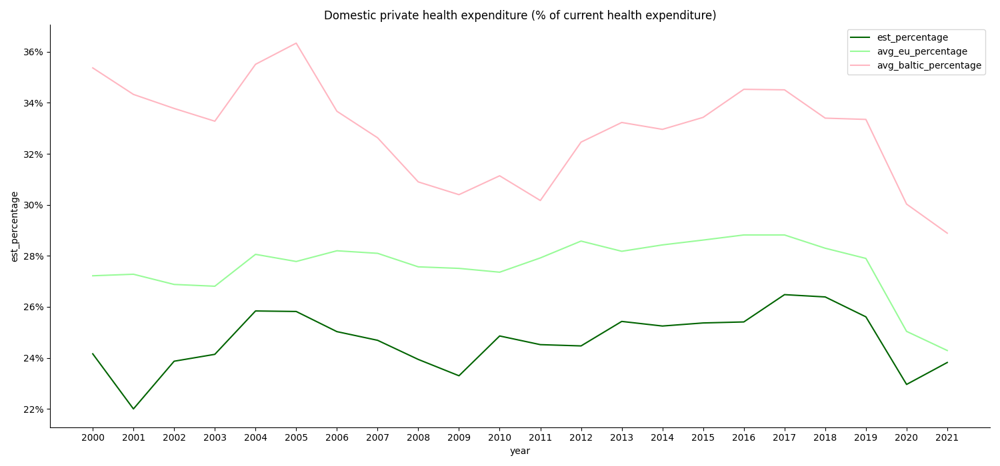
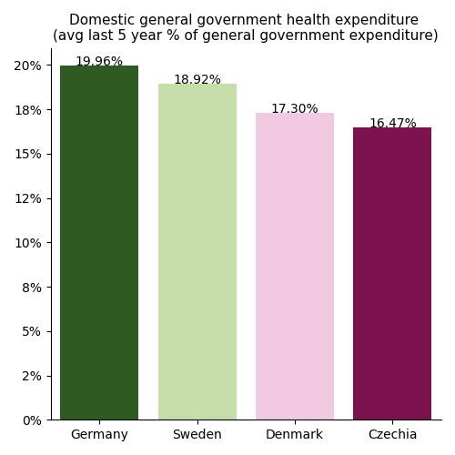
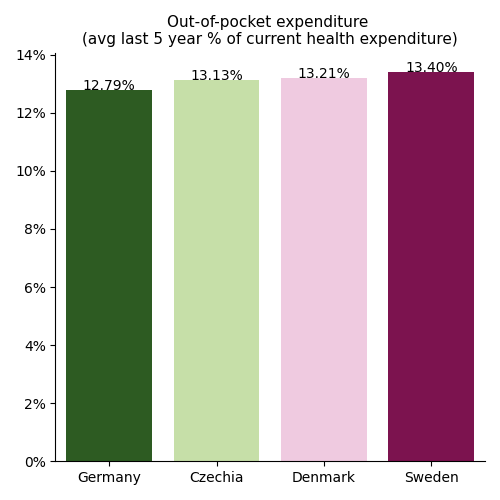
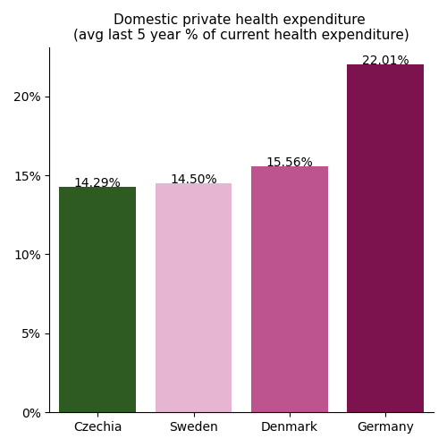

# Introduction

Being worried about the current state of healthcare in Estonia, I decided to conduct a little research on the healthcare system in Estonia and compare it to EU and Baltic countries' indicators.

# Tools

- **Python** (Pandas, Matplotlib, Seaborn, Sqlalchemy)**:** The main tool in my research, enabling me to work with data, databases, create visualizations and gain insights.
- **SQL:** A very useful tool to query the database making my job more convinient when used in conjunction with Python.
- **PostgreSQL:** Used database system.
- **Visual Studio Code:** An excellent environment for data management and working with different tools.

# Goals

- To research and compare the Estonian healthcare system indicators.
- To improve data cleaning and manipulation skills.
- To enhance Python skills by working with key data analysis tools - **Pandas**, **Matplotlib** and **Seaborn**.
- To work closely with a PostgreSQL database in Python using the **Sqlalchemy** library.

# Research

## 1. Questions

1.	How have Estonian government expenses on healthcare changed over time? How these changes compare to EU countries' indicators? How these changes compare to Baltic countries' indicators?
2.	How have people’s out-of-pocket expenses on healthcare changed in Estonia? How these changes compare to EU countries' indicators? How these changes compare to Baltic countries' indicators?
3.	How have expenses in private healthcare changed in Estonia? How these changes compare to EU countries' indicators? How these changes compare to Baltic countries' indicators?
4.	Which is the best country in the EU based on healthcare indicators?

## 2. Preparation

### 2.1. Data

The data was taken from https://databank.worldbank.org/.

### 2.2. Data Cleaning and Manipulation

The process of data cleaning and manipulation is performed in the [data manipulation file](/python_data_analysis\data_manipulating.py/). The data was manipulated and cleaned to ensure compatibility with analysis of the EU countries healthcare indicators. It also was divided into several tables to avoid overloading and facilitate management of connections between tables. The primary tool used for this process was Pandas.

### 2.3. Database

The main reason of importing data into the PostgreSQL database is to test working closely with SQL queries within Python using Sqlalchemy. The data import process for PostgreSQL is documented in the [PostgreSQL data importing folder](/sql_inserting_data/). This folder contains files that detail the creation on the database, tables and data insertion, ensuring proper connections between tables.

## 3. Analysis

The analysis process with Python and SQL queries is performed in the [analysis python file](/python_data_analysis\analysis.py/).

The analysis focused on three healthcare system indicators:
 - Domestic general government health expenditure
 - Out-of-pocket health expenditure
 - Domestic private health expenditure

**It is important to note** that the Estonian data is currently limited to the year 2021.

### 3.1. How has Estonian government expenditure on healthcare changed over time? How these changes compare to EU countries' indicators? How these changes compare to Baltic countries' indicators?

**Picture 1**. *Domestic general government health expenditure*

From 2000 to 2021 percentage of Estonian goverment expenditure on healthcare increased. On average, the indicator is higher than the average for Baltic countries, but lower than the average indicator for EU countries. However, in 2021, the average percentage for Baltic countries began to grow faster than Estonia's. This suggests that the governments of Estonia's neighbours, Latvia and Lithuania, started to allocate a larger share of their budgets to healthcare. The fast increase in 2021 could be a response on the COVID-19 Pandemic.

### 3.2. How have people’s out-of-pocket expenses on healthcare changed in Estonia? How these changes compare to EU countries' indicators? How these changes compare to Baltic countries' indicators?

**Picture 2**. *Out-of-pocket expenditure on healthcare*

From 2000 to 2021 the percentage of people's out-of-pocket expenses on healthcare in Baltic countries was higher on average than in Estonia and EU countries.

From 2000 to 2003, people in Estonia spent less on healthcare from theirs pocket than in EU countries on average, likely reflecting the economic challenges following the dissolution of the USSR. However, indicator in Estonia began to rise from 2004 onwards, having fluctuations around the 2008-2009 financial crisis.

Overall, the trend probably tells that Estonians historically relied less on government in terms of healthcare compared to the EU average. Nevertheless, government support for healthcare in Estonia remained better that the average in Baltic countries throughout the period from 2000 to 2021.

### 3.3. How have expenditures in private healthcare changed in Estonia? How these changes compare to EU countries' indicators? How these changes compare to Baltic countries' indicators?

**Picture 3**. *Domestic private health expenditure*

In Estonia, from 2000 to 2021, the trend of the share of current health expenditures funded from domestic private sources such as households, corporations and non-profit organizations was not stable and fluctuated. Overall, on the average percantage of private healthcare expenditure in EU countries was higher and more stable than in Estonia throught this period. In contrast, Baltic countries exhibited a much less stable trend with significally higher average indicator compared to Estonia and EU countries.

The fluctuations in Estonia can likely be attributed to the 2008-2009 financial crisis and the COVID-19 pandemic.

Following up on the previous question (3.2), in Estonia, a larger portion of private healthcare funding comes from households compared to the average indicator in EU countries. In the EU, private healthcare is mostly financed by corporations and non-profit organizations.

### 3.4 Which is the best country in the EU based on healthcare indicators?

Based on the healthcare data analyzed for question 4, the following EU countries emerged as the top destinations where people can depend heavily on government support for healthcare in the last five years:
- Germany
- Sweden
- Denmark
- Czech Republic

These countries will now be further compared based on three key healthcare system indicators.

Among the top EU countries for public healthcare reliance, Germany has consistently allocated the highest percentage of government spending on healthcare over the last five years. (Picture 4)

  
**Picture 4**. *Government health expenditure (top ranked countries)*

Additionally, picture 5 highlights that Germany has the lowest average out-of-pocket healthcare costs compared to the other countries analyzed. It's worth mentioning that the indicator variation among the countries is minimal here.

  
**Picture 5**. *Out-of-pocket expenditure on healthcare (top ranked countries)*

Based on the data presented in the next barplot,  Germany has the highest average percentage of private healthcare expenditure compared to the other countries analyzed over the last five years. 

  
**Picture 6**. *Private health expenditure (top ranked countries)*

Following up the previous indicator (Picture 5) it is revealed that the private healthcare in Germany is typically financed by corporations and non-profit organizations.

## 4. Conclusion

Estonia's healthcare system exhibits greater stability and reliability compared to the average in Baltic countries. However, EU countries generally boast better healthcare indicators. On average, the EU demonstrates a more reliable government approach to healthcare compared to Estonia. Additionally, EU countries typically see a more significant impact on healthcare from corporations and non-profit organizations, which contributes to fewer barriers for individuals.

Analysis of healthcare system indicators in the top-ranked countries over the past five years reveals Germany's potential edge over Sweden, Denmark, and the Czech Republic. Germans enjoy a high level of reliance on government-funded healthcare. Additionally, active participation by corporations and non-profit organizations significantly impacts the German healthcare system, contributing to its stability and lower barriers for individuals.

# What I learned

The project enhanced my skills in data analysis:
- **Project management** - Planning and structuring project
- **Python** - Data manipilation with Pandas, data visualizations with Matplotlib and Seaborn
- **SQL** - Complex query crafting including Common Table Expressions (CTEs)
- **Database integration** - Experience in working closely with the PostgreSQL database within Python

Furthermore, the research provided valuable insights that deepened my understanding of the healthcare systems in the EU and Estonia.